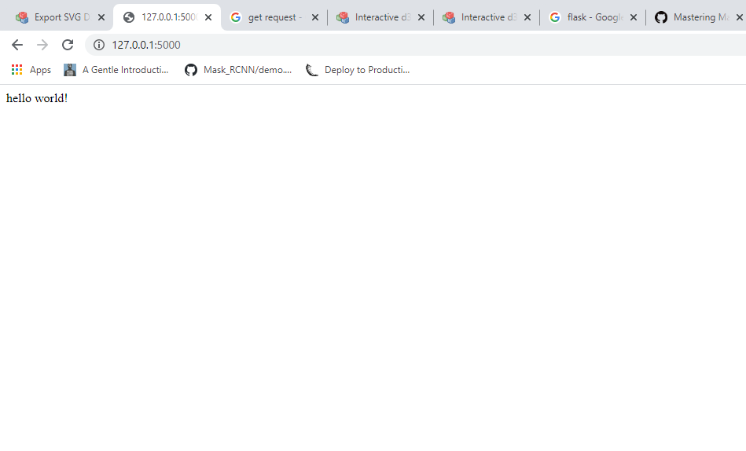

# Getting started with Flask

Flask is a micro web framework written in Python. It is classified as a microframework because it does not require particular tools or libraries. It has no database abstraction layer, form validation, or any other components where pre-existing third-party libraries provide common functions. Our the requirements will be :

- Flask module
- Python 3 (flask supported)

    ```python
    pip install flask
    ```

Above command install flask module in windows through command prompt.

Now,we start how things work in flask

## Making our first flask web app

1. Create a python file with name `app.py`.
2. Now time to write some code in it,for our first time we will be making a basic web app showing ``hello world !`` ,like always!

    ```python
    from flask import Flask

    app = Flask(__name__)

    @app.route("/")
    def home():
        return "hello world!"

    if __name__ == ""__main__":
        app.run()
    ```

3. To run the above code , just go to your command  prompt and enter.

    ``` python
    python app.py
    ```


At the end after running the above command you will see a local id address with a port number whichis like this `` 127.0.0.1:5000 ``, just copy it and then paste it into any web browser. After doing this you will see this there



You have made your first flask app !!

Here, we created a decorator named app and used is to pass a route or you can say url which is ` "/" ` ,when the user is on this page he will see message written ``hello world!``

> Note : If you try to write anything after the url for now, you will get an error because you have not yet defined it yet.

This is it for our first app in flask,we will discuss more about it on in later pages.

## Using JSON in Flask

In last page we made our first flask app,so let's make it more usable than simply writing `hello world!`

This time we are going take some input from a user and put it into a file so that we can use it later.
So, let's get started with it

1. This time,we also want user to see some good UI,so we are going to start with making an html page to make it look good. But, show this you have to make a folder named ``templates`` where your python code will be locateda and create the HTML file there, because by default flask searchs for HTML files in templates
In this case our html file is `"show.html"` having this -

    ```HTML
    <h1>
    {{fname}} {{lname}}
    </h1>
    ```

    And another html file named `"flask_json_dump.html"` for taking inputs from user using HTML forms and it will be like this :

    ```HTML
    <html>
        <body>
            <h1> Enter Your name</h1>
            
            <form action="name" method="POST">
                First Name
                <input type="text" name="fn">
                Last Name
                <input type="text" name="ln">
                <br>
                <button type="submit" name="sub_button" value="submit">Submit</button>
            </form> 


        </body>
    </html>
    ```

2. Also,we need our python code to work with it, which is-

    ```Python
    #Flask Basic Dump in JSON File

    from flask import Flask,request,render_template
    import json 

    app = Flask(__name__)
    app.secret_key = "it is the secret key"

    @app.route("/")
    def homepage():
        return render_template("json_load_html.html")

    @app.route("/name",methods=["GET","POST"])
    def nm():
        if request.method == "POST":
            names = {}
            with open("names.json","w") as f:  

                #Simple Json Dump       
                names[request.form["fn"]] = {"name":request.form["ln"]}
                json.dump(names,f)

            return render_template("show.html", fname=request.form["fn"],lname=request.form["ln"])

    if __name__ == "__main__":
        app.run(debug= True)
    ```

3. Now, on running this python code and on going to route `name` and find it just shows ``fname lname`` you entered through form, which is taken using `request.form["elemnent_name"]`.

You can see this in code

> request.method == "POST"

We because we want data from the user so it is defined using `"POST"` generally.

In this piece of code we also imported request,render_template in which request helps us to get data(POST) which the user inputs through the html page while render_template helps in passing the HTML page we want to the user to see.
Also, we have imported module named `json` to help us with storing the data.

Also,each Flask web application contains a secret key which used to sign session cookies for protection against cookie data tampering. It's very important that an attacker doesn't know the value of this secret key. Your application is using a weak/known secret key and Acunetix managed to guess this key.
